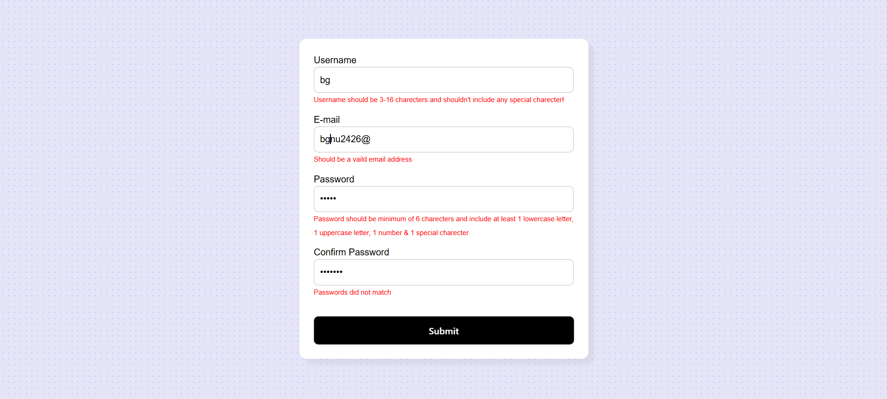

# React Forms

This is a simple React project that demonstrates how to create and manage forms using React hooks. The project includes examples of form validation, custom input components, error messages, and multi-step forms.

## Project Structure

## Installation

1. Clone the repository:
    ```sh
    git clone https://github.com/bgmanu2426/Reactive_React_Forms.git
    ```
2. Navigate to the project directory:
    ```sh
    cd Reactive_React_Forms
    ```
3. Install the dependencies:
    ```sh
    pnpm install
    ```

## Usage

1. Start the development server:
    ```sh
    pnpm run dev
    ```
2. Open your browser and navigate to `http://localhost:5173`.

## Application Screenshot



## Features

- Form validation
- Custom input components
- Error messages for invalid inputs
- Responsive design
- Real-time input feedback
- Multi-step form support
- Integration with external APIs

## Applications

This project can be used for:

- Building user registration forms
- Creating multi-step forms for surveys or applications
- Implementing real-time form validation
- Integrating forms with external APIs for data submission